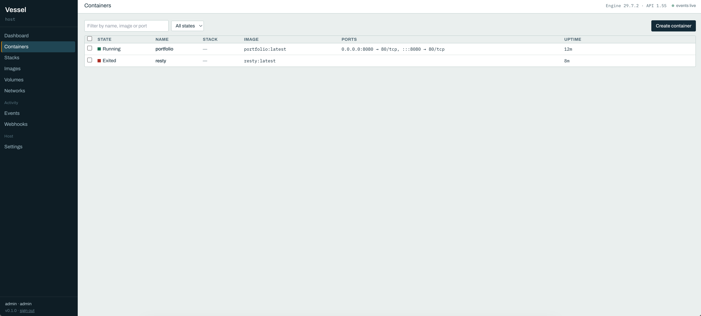

# Vessel

Vessel is a single-binary web UI for Docker on **one host**. No agent, no
database required, no sidecar assets — download one file, run it, and manage
containers, images, volumes, networks, and webhooks from a browser.

**Single-host only.** Vessel talks to one Docker Engine API endpoint. It does
not do Swarm, Kubernetes, multi-host fleets, or (yet) `docker compose` deploys
or registry pushes — see [Roadmap](#roadmap) for what's coming and what's
deliberately out of scope.

<!-- TODO: replace with a real screenshot of the running UI before v0.1.0 release -->


## Install

**Script** (Linux/macOS, downloads the matching release binary and verifies
its checksum):

```bash
curl -fsSL https://raw.githubusercontent.com/0funct0ry/vessel/main/install.sh | sh
```

**Go toolchain:**

```bash
go install github.com/0funct0ry/vessel@latest
```

**Docker:**

```bash
docker run -d --name vessel \
  -p 7373:7373 \
  -v /var/run/docker.sock:/var/run/docker.sock \
  -v vessel-data:/data \
  ghcr.io/0funct0ry/vessel:latest \
  serve --addr 0.0.0.0 --auth --db /data/vessel.db
```

**Manual:** download a binary for your OS/arch from
[Releases](https://github.com/0funct0ry/vessel/releases).

## Quick start

```bash
vessel serve
```

Open `http://localhost:7373`. That's it — Vessel runs fully in-memory by
default (no `--db` needed) and shows the containers already on your machine.

## Security

Vessel proxies the Docker socket, which is root-equivalent on the host:
**anything that can reach Vessel's API can own the machine.** Every default
is chosen with that in mind.

`vessel serve` refuses to bind a non-loopback address unless `--auth` is on:

```
refusing to bind 0.0.0.0 without --auth
Vessel proxies the Docker socket, which is equivalent to root on this host.
Either bind loopback and use an SSH tunnel:
  ssh -L 7373:127.0.0.1:7373 user@host
or create a user and enable auth:
  vessel user add admin --role admin --db vessel.db
  vessel serve --db vessel.db --auth --addr 0.0.0.0
Override at your own risk with --i-know-what-im-doing.
```

This is a deliberate product feature, not a papercut. If you're exposing
Vessel beyond `127.0.0.1`, put a user and `--auth` in front of it, or tunnel
over SSH instead.


## Contributing

```bash
make build && make test && make lint
```

Commits reference the milestone they belong to: `[M<n>] Title`. See
`internal-docs/SPEC.md` and `internal-docs/PROMPTS.md` for the full spec and
build plan.

## Licence

MIT — see [LICENSE](LICENSE).
